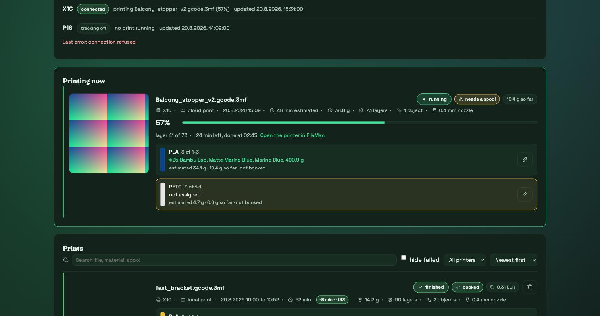
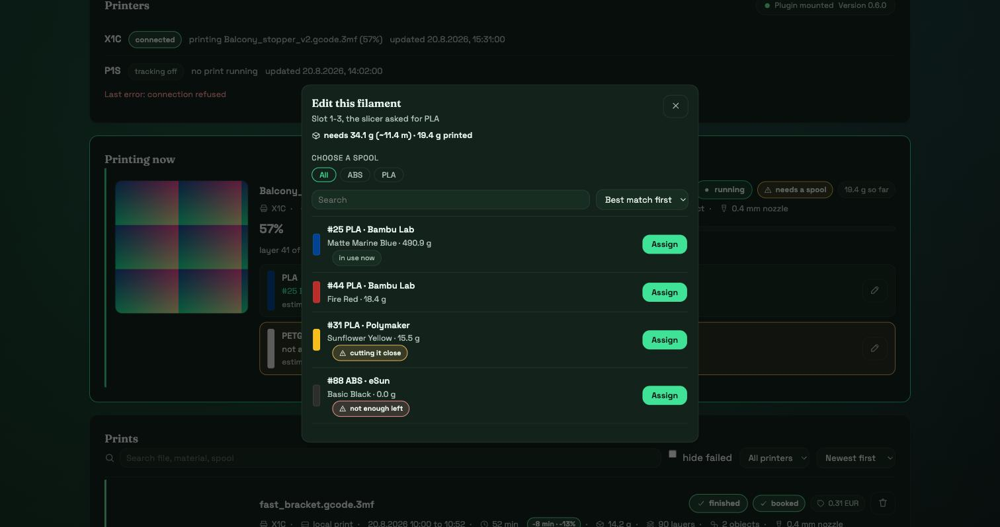
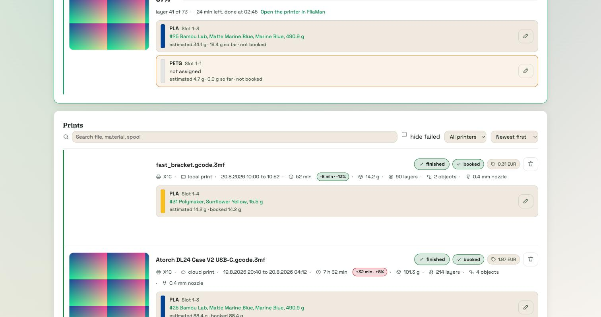

# FilaManBambuUsage

**A plugin for [FilaMan](https://github.com/Fire-Devils/filaman-system) that
deducts the filament a Bambu Lab print used from the matching FilaMan spools,
by itself.**

It attaches to every Bambu Lab printer FilaMan already knows, notices when a
print starts, reads the 3MF the printer is working from, and books the consumed
grams against the right spool when the print ends. Nothing has to be configured
twice: the credentials and the AMS slot assignments come from the printer that
is already set up in FilaMan.



## What it does

- **Watches every printer** whose `driver_key` is `bambulab`, over its own MQTT
  connection, and follows `gcode_state` from start to finish
- **Reads the 3MF** off the printer over FTPS at print start: consumption per
  filament, the plate preview, and the **share of each filament used at every
  layer**, streamed out of the plate gcode
- **Maps slicer slots to spools** through `ams_mapping` and FilaMan's own
  `PrinterSlotAssignment`, and where there is no assignment, by the **RFID tag
  of the tray**: the printer reports a uuid per tray, FilaMan keeps the same
  value on the spool as `rfid_uid`. Anything that still cannot be resolved
  stays open rather than guessed at
- **Books through FilaMan's own `SpoolService`**, so the movement appears in the
  spool log like any other, with `source = bambu_usage`
- **Deducts an aborted print at the share it actually reached**, taken from the
  layer curves rather than from the percentage of time, because a filament used
  only in the last third costs nothing when the print stops halfway
- **Keeps a history** with plate previews, cost per print, deviation from the
  slicer's estimate, search and filters, and correction by hand: reassign a
  spool (which moves the booking with it), correct an amount, delete an entry
- **Warns while a print runs** when the assigned spool does not hold enough for
  what is left to print



## Status

**Version 0.8.0. It works, and it has booked a real print.**

Verified end to end on hardware: the print was detected, the 3MF fetched over
FTPS, slicer filament 4 resolved to AMS slot 1-3 and from there to spool 25,
34.09 g booked, the spool went from 525.01 g to 490.92 g, and the movement shows
up in FilaMan's spool log with `source = bambu_usage`.

### What nobody has tried yet

Written down plainly, because it is the first thing worth knowing:

- **Only one printer model has ever run it: an X1C.** P1, A1 and H2D are
  untouched.
- **No abort on real hardware.** The proportional booking is covered by unit
  tests and by three real 3MF files, but never by an actual cancelled print.
- **No spool change mid print**, as auto refill would cause. The code splits a
  filament row at the moment of the change and books both halves separately,
  and that path has only ever run in tests.
- **Resolving a spool by its RFID tag has never run on hardware.** It exists
  because FilaMan's Bambu Lab driver keeps a tray's type and colour but not its
  `tray_uuid`, so nothing over there can match the tag against the spool that
  carries it, and every print arrived with nothing assigned. Measured on a
  running instance, then built; never yet seen resolving a real print.
- **Local prints**, started from the printer's display or from SD, are not built
  at all yet.

The test suite has 232 tests and runs on the standard library alone.

## How it works

```
MQTT (print.gcode_state, ams_mapping, subtask_id)
   -> print start recognised
FTPS (bambulabs_api)
   -> 3MF: used_g per filament, plate preview, layer curves from the gcode
FilaMan (PrinterSlot, PrinterSlotAssignment)
   -> which spool sits in which tray
print ends
   -> SpoolService.record_consumption(), one booking per spool
```

The plugin keeps its own tables under a private `MetaData`, so Alembic never
touches them and they survive an update. It never writes into FilaMan's own
tables, with one exception that is the whole point: the spool booking, and that
goes through FilaMan's service rather than around it.

## What it deliberately does not do

AMS overview, assigning a spool to a tray, reading RFID, auto matching. FilaMan's
Bambu Lab driver already does all of that, better than a reimplementation could.
This plugin only reads that state. It also does not talk to the Spoolman
compatibility API, and it does not write `printer_slot_assignments`, because the
driver owns that table and rewrites it from the printer's own reports.

## Installing

1. In FilaMan, go to **Admin, Plugins**
2. Upload `bambu_usage-<version>.zip` from the
   [releases page](https://github.com/Niko11111/FilaManBambuUsage/releases), or
   build it yourself, see below
3. **Bambu Usage Tracking** appears in the navigation

No restart is needed for the page, FilaMan resolves plugin pages per request.
The router is mounted at startup, so a first installation does need one restart
before the endpoints answer.

## Requirements

- FilaMan with support for `plugin_type: "integration"`
- At least one printer with `driver_key == "bambulab"`, which is where host,
  serial and access code come from
- The printer reachable on the LAN over MQTT and FTPS. The Bambu cloud is not
  used

If FilaMan holds no slot assignment for a tray, the print still lands in the
history: its rows are marked as open and a spool can be picked by hand, after
which the booking runs as usual.

## Building

```bash
python3 tools/build_zip.py            # -> dist/bambu_usage-<version>.zip
python3 tools/build_zip.py --check    # validate only
python3 tools/build_zip.py --selftest # prove the validation bites

python3 tools/check_architecture.py          # module boundaries hold
python3 -m unittest discover -s tests -t .   # unit tests, stdlib only
```

The build mirrors FilaMan's own checks: extension allow list, size limit,
required files, manifest schema. What passes here is accepted by FilaMan.
Building the same version twice is refused, because a version number has to
describe exactly one package.

## Languages

English and German, following whatever is selected in FilaMan: the page reads
the same `localStorage['lang']` the main application uses, so there is no
separate switch. Adding a language means adding one file under
`bambu_usage/locales/`, for example `fr.json`, using `en.json` as the template.
No HTML and no Python has to change, and missing keys fall back to English
rather than leaving a blank.

All three FilaMan themes are supported.



## Why

FilaMan's Bambu Lab driver reads only `print.ams` and `print.vt_tray` out of the
MQTT payload, which is the AMS slot state and nothing else. It discards
`gcode_state`, `subtask` and `ams_mapping`, so it never learns about print jobs
and never deducts anything.

For Spoolman, [OpenSpoolMan](https://github.com/drndos/openspoolman) solves
exactly this. This plugin brings the idea to FilaMan, with three differences:

| | OpenSpoolMan | this plugin |
|---|---|---|
| Printers | exactly one, hard wired through environment variables | any number, taken from FilaMan's printer list |
| Configuration | eleven environment variables, no interface | a page in FilaMan, credentials reused from the existing printer |
| Runtime | its own container next to Spoolman | runs inside FilaMan |

## Documentation

| Document | Contents |
|---|---|
| [`docs/01_Design.md`](docs/01_Design.md) | design, sequence, failure cases, decisions |
| [`docs/02_FilaMan_Plugin_API.md`](docs/02_FilaMan_Plugin_API.md) | how FilaMan's plugin system works |
| [`docs/03_Bambu_Data_Sources.md`](docs/03_Bambu_Data_Sources.md) | MQTT fields and the structure of the 3MF |
| [`docs/04_Data_Model.md`](docs/04_Data_Model.md) | the plugin's tables and the FilaMan models it reads |
| [`docs/05_Research_Sources.md`](docs/05_Research_Sources.md) | evidence, by repository, file and location |

## Contributing

Pull requests are welcome. Please read [`CONTRIBUTING.md`](CONTRIBUTING.md)
first: it holds the conventions this repository is built on, including the
module boundaries that `tools/check_architecture.py` enforces.

## License

MIT, see [`LICENSE`](LICENSE). The consumption logic is ported from OpenSpoolMan
(MIT); ported parts and their origin are recorded in [`NOTICE`](NOTICE). No code
is taken from the FilaMan plugin repositories, which carry no license file.
